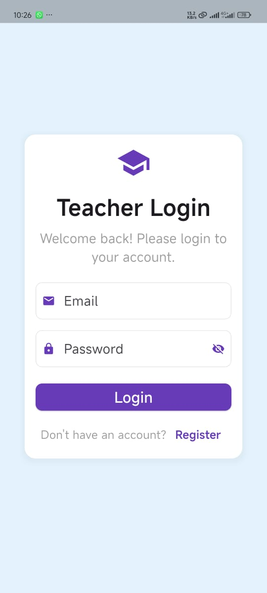
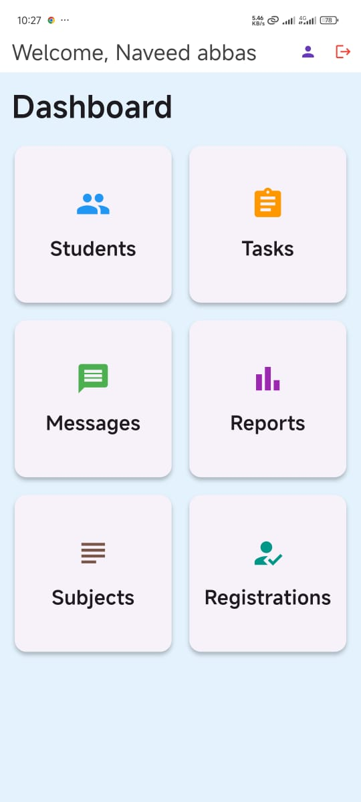
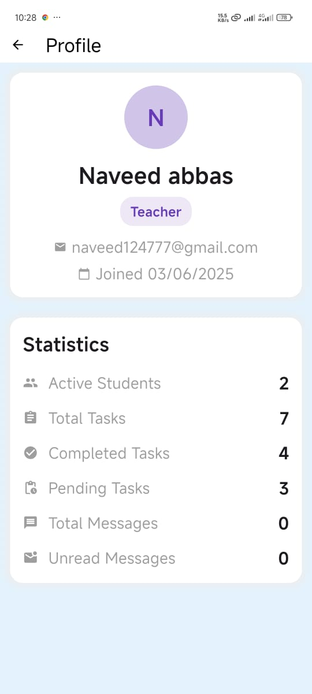
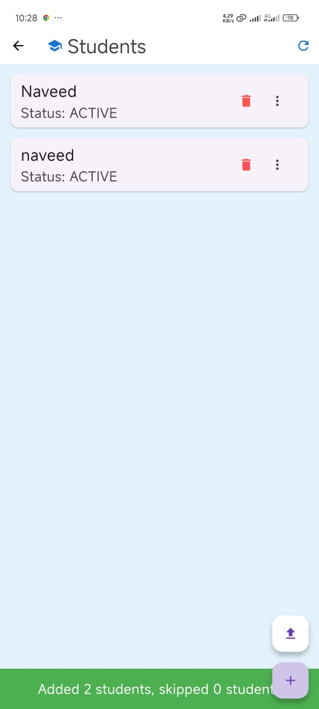
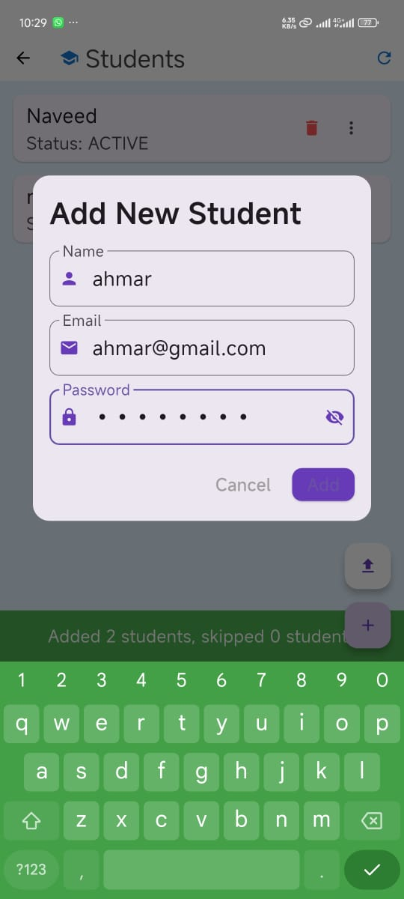
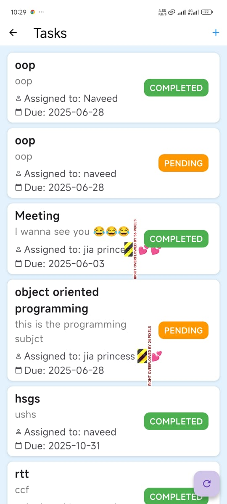
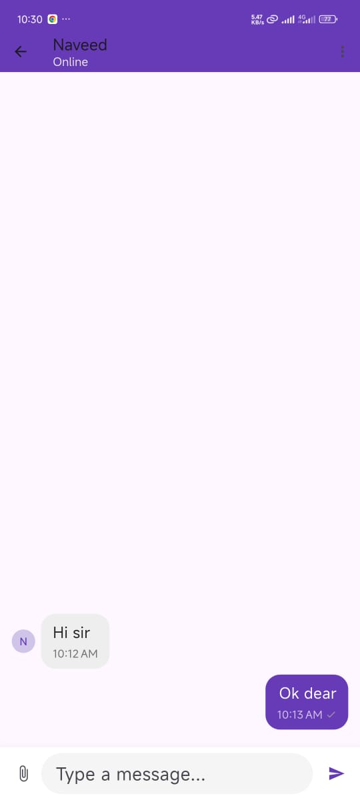
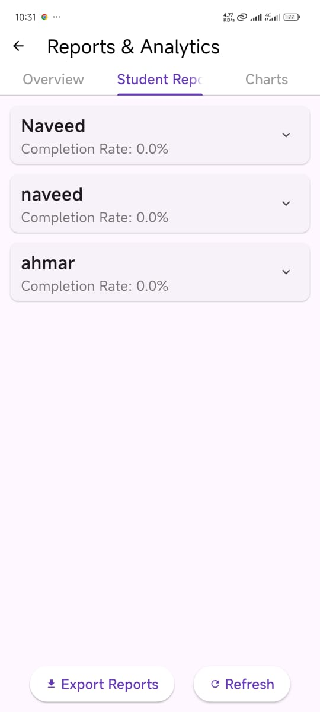
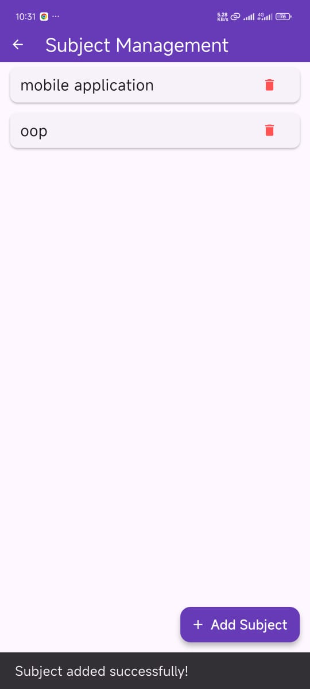
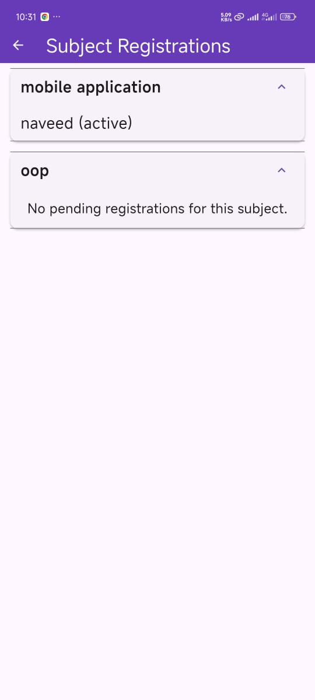

# teacher_app

A new Flutter project.

## Getting Started
< Teacher app

Modules
Students: This module allows teachers to view and manage all the students they have added to the system. Currently, it enables teachers to add new student profiles.
Tasks: 
In this module, teachers can create, assign, and delete tasks for their students. They can also view the tasks they have assigned to each student.
Messages:
 This module facilitates communication between teachers and their students. Teachers can view their list of students and initiate one-on-one chats with them.
Reports: 
 It's intended to provide teachers with various reports on student progress, performance, or other relevant data.
Subjects:
This module enables teachers to manage the subjects they teach. They can add new subjects, edit existing ones, and enroll their students in specific subjects. They also have the ability to delete subjects.
Registrations: In our current implementation, new users register as teachers directly via the authentication screen, and teachers add students through the "Students" module. There isn't a separate "Registrations" module in the code for managing new sign-ups beyond the initial teacher registration.

